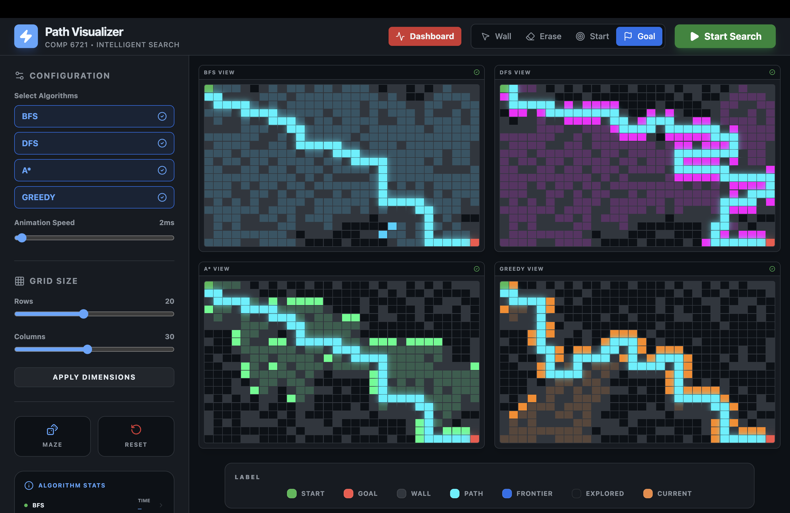

# Path-Finder-Algorithms

A small interactive visualizer of common path-finding algorithms (DFS, BFS, A* and Greedy) built with React + TypeScript + Vite. Select algorithms, adjust grid size and speed, generate mazes, and see runtime/metrics for each algorithm.

## Screenshots



## Features
- Visual implementations of: BFS, DFS, A*, GREEDY
- Interactive grid with start/goal, walls, and maze generation
- Adjustable grid size and animation speed
- Per-algorithm execution time and result display

## Tech stack
- React + TypeScript
- Vite
- Tailwind CSS (utility classes used in components)
- Icons: lucide-react

## Quick Start / Prerequisites
- Node.js (LTS recommended)
- npm (or pnpm/yarn)

## Install
```bash
npm install
```

## Run (development)
```bash
npm run dev
# open the URL printed by Vite, usually http://localhost:5173
```

## Build / Preview
```bash
npm run build
npm run preview
```

## Project structure (important files)
- `index.html` — app entry
- `package.json`, `tsconfig.json`, `vite.config.ts` — tooling
- `src/`
  - `main.tsx` — React entry
  - `App.tsx` — top-level app
  - `components/`
    - `Sidebar.tsx` — UI controls and algorithm stats
    - `GridArea.tsx` — interactive grid
    - `Header.tsx`, `Dashboard.tsx`, etc.
  - `algorithms/` — implementations:
    - `bfs.ts`, `dfs.ts`, `astar.ts`, `greedy.ts`
    - `index.ts` — `runAlgorithm()` dispatcher
  - `hooks/`
    - `usePathfinding.ts` — core orchestration of algorithm runs
  - `types.ts` — shared types and `AlgorithmResult`

## How algorithms are run
- `runAlgorithm(type, grid, start, goal)` in `src/algorithms/index.ts` dispatches to the chosen implementation.
- Each algorithm returns an `AlgorithmResult` used by the UI to display `execTimeMs`, `found`, and path/visited nodes.

## Troubleshooting
- If you see runtime errors like `Cannot read properties of undefined (reading 'toFixed')`, it means an algorithm result is missing the numeric `execTimeMs`; the sidebar now guards the display to avoid crashes.
- If `npm install` fails due to cache/permission errors, fix npm cache ownership:
```bash
sudo chown -R "$(whoami)" ~/.npm
rm -rf ~/.npm/_cacache/tmp/*
npm cache verify || npm cache clean --force
npm install
```

## Adding a new algorithm
1. Add implementation file to `src/algorithms/`, export a function that matches existing signatures.
2. Add export/import and update `runAlgorithm` in `src/algorithms/index.ts`.
3. Add the algorithm name to `ALGORITHMS` in `src/components/Sidebar.tsx` to expose it in the UI.

## Contributing
See `CONTRIBUTING.md` for contribution guidelines.

## License
This project is released under the MIT License. See `LICENSE` for details.
